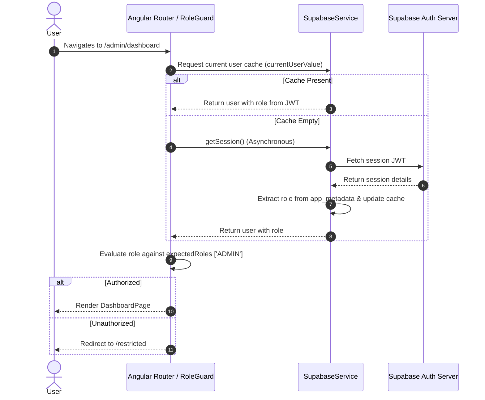

# Technical Design: Auth Router Guards & Role Redirection

## Technical Approach
- Extract and prioritize user role from the Supabase session JWT (`session.user.app_metadata.role`) instead of querying the `profiles` database table.
- Update `SupabaseService` to subscribe to auth state changes using `onAuthStateChange`, mapping the session directly to the `currentUserSubject` cache.
- Optimize `RoleGuard` to execute checks synchronously from local cache or retrieve the session asynchronously, bypassing all database queries.
- Introduce `/admin/dashboard` as the default landing route for the `ADMIN` role.
- Configure `LoginPage` to route users based on their role: `ADMIN` -> `/admin/dashboard`, others -> `/home`.

---

## Architecture Decisions

| Decision Area | Options | Tradeoffs | Selected Decision |
| :--- | :--- | :--- | :--- |
| **Role Retrieval Source** | A: JWT app_metadata<br>B: Database (profiles table) | A: Instant checks, zero DB latency, propagation delay if role changes.<br>B: Instant DB synchronization, but high latency on page transitions. | **Option A (JWT app_metadata)**: Prioritizes performance and low-latency navigation. Security risks are mitigated by backend database RLS policies. |
| **Auth Cache Sync** | A: Manual state tracking inside login/logout<br>B: Event-based via `onAuthStateChange` | A: Prone to desync during token refreshes or external sessions.<br>B: Subscribes directly to Supabase Auth event bus, ensuring synchronization. | **Option B (onAuthStateChange)**: Establishes a single, reactive source of truth for session status. |
| **Landing Navigation** | A: Redirection via global Guard<br>B: Role-specific landing routes | A: Simple configuration but less user-friendly.<br>B: Tailored UX (e.g., custom admin dashboard vs client home). | **Option B (Role-specific routes)**: Routes users directly to their primary interfaces post-auth. |

---

## Data Flow


---

## File Changes

### Modified Files

| File Path | Action | Description |
| :--- | :--- | :--- |
| `frontend/src/app/supabase.service.ts` | Modify | Update constructor with `onAuthStateChange` handler. Extract profile data (including role) from JWT token claims. Update `login` and initialization methods to bypass manual `getUserProfile` calls. |
| `frontend/src/app/core/guards/role.guard.ts` | Modify | Update `canActivate` to read role from cache or asynchronously from session metadata (`app_metadata.role`) on cache miss. Remove database query dependencies. |
| `frontend/src/app/app.routes.ts` | Modify | Register `/admin/dashboard` page. Change default `/admin` redirect path from `nodos` to `dashboard`. |
| `frontend/src/app/pages/login/login.page.ts` | Modify | Redirect `ADMIN` to `/admin/dashboard` and all other roles (`NODO`, `CLIENTE`, etc.) to `/home`. |

### New Files

| File Path | Action | Description |
| :--- | :--- | :--- |
| `frontend/src/app/pages/admin/dashboard/dashboard.page.ts` | Create | Standalone Angular component implementing the Admin Dashboard layout, importing Ionic components and injecting `Router`/`SupabaseService`. |
| `frontend/src/app/pages/admin/dashboard/dashboard.page.html` | Create | Ionic UI template displaying quick-access navigation cards to `/admin/nodos` and `/admin/productos`, and a header log out button. |
| `frontend/src/app/pages/admin/dashboard/dashboard.page.scss` | Create | CSS/SCSS layout styles using Ionic utility classes. |

---

## Interfaces & Contracts

### User Profile Payload (`Profile` interface)
The data stored in `currentUserSubject` conforms to the existing contract:
```typescript
export interface Profile {
  id: string;
  email: string;
  first_name: string;
  last_name: string;
  role: string; // Extracted from JWT app_metadata.role
}
```

---

## Testing Strategy
1. **JWT Verification**: Manually log in with users of different roles (`ADMIN`, `NODO`, `CLIENTE`) and verify they are correctly redirected to their respective paths (`/admin/dashboard` or `/home`).
2. **Access Control**: Attempt unauthorized access by typing admin routes (`/admin/dashboard`, `/admin/nodos`) directly while logged in as a non-admin, ensuring proper redirection to `/restricted`.
3. **Database Performance Check**: Monitor browser Network Tab during transitions to ensure no SQL calls to `profiles` are executed by guards or page routing logic.

---

## Migration & Rollout
- No database migrations are required.
- Existing user accounts must have their role set in their Supabase Auth metadata. Run a SQL script to sync `profiles.role` to `auth.users.raw_app_meta_data` if needed.

---

## Open Questions
- None.
