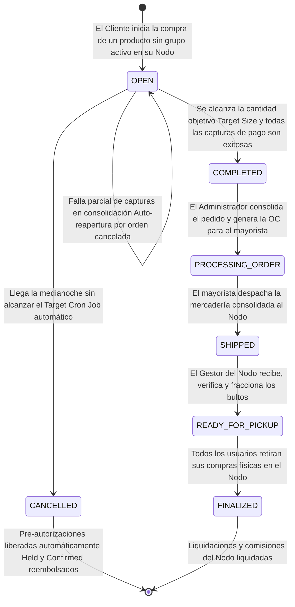
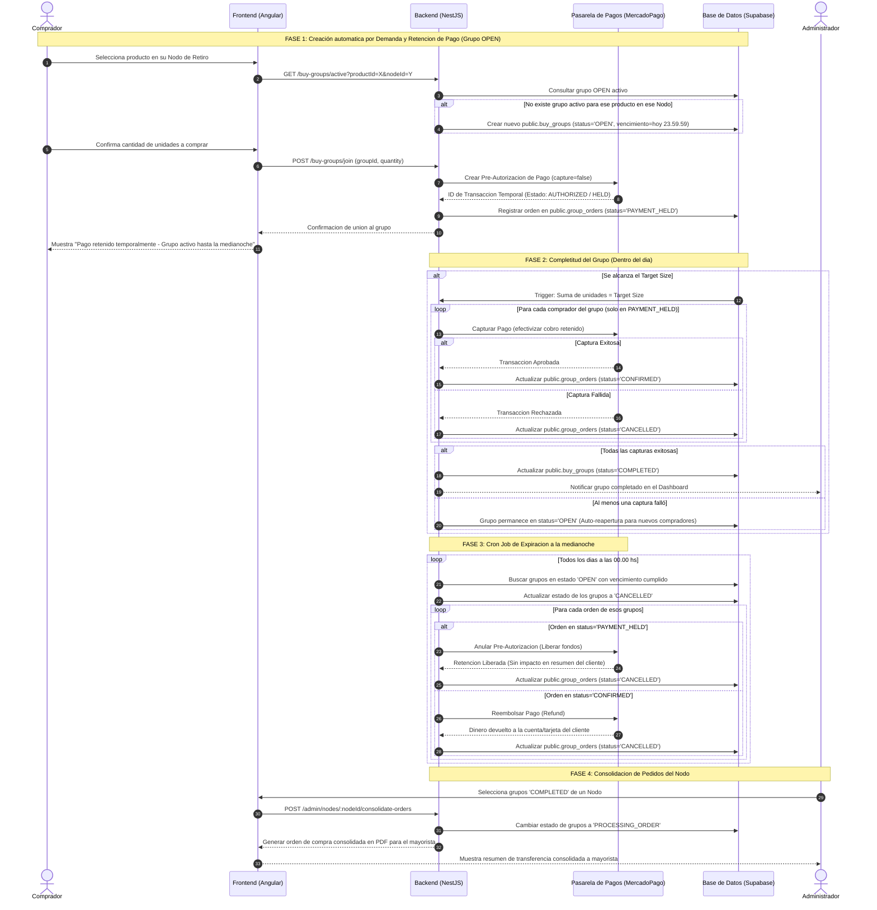

# Arquitectura y Flujo de Compras Grupales: Redeco

Este documento detalla el diseño de arquitectura, la máquina de estados y el flujo de transacciones financieras para los **Grupos de Compra Colectiva** en Redeco, adaptados a las reglas de negocio específicas del proyecto.

---

## 1. Reglas de Negocio Clave

1. **Creación por Demanda del Cliente**: El administrador no crea los grupos manualmente. Cuando un cliente selecciona un producto en su Nodo de Retiro y **no existe un grupo activo (OPEN)** para ese par (Producto - Nodo), el sistema crea automáticamente un nuevo grupo en estado `OPEN`.
2. **Congelamiento de Precios (Vencimiento Diario)**: Todos los grupos creados expiran de forma automática a las **24.00 hs (medianoche) del mismo día**. Esto simula la convención mayorista de congelamiento de precios por 24 horas.
3. **Cancelación Automática**: A medianoche, un proceso en segundo plano (Cron Job) cancela automáticamente todos los grupos que no llegaron a su `target_size`, liberando las pre-autorizaciones de cobro de forma inmediata sin intervención humana.
4. **Consolidación y Orden de Compra**: Cuando un grupo alcanza su `target_size`, se marca como `COMPLETED` y se efectiviza la captura del cobro de todos los integrantes. Posteriormente, el Administrador interviene para consolidar todos los grupos completados de un Nodo y generar la **Orden de Compra Unificada** para enviar al mayorista.

---

## 2. Máquina de Estados de los Grupos de Compra (`buy_groups`)

El ciclo de vida del grupo de compra colectiva refleja las automatizaciones y restricciones horarias definidas:

---

## 3. Mapeo y Relación de Estados (Grupo vs. Órdenes)

Para garantizar la consistencia, el ciclo de vida del grupo de compra (`buy_groups`) se sincroniza con el estado de las órdenes individuales de los clientes (`group_orders`):

| Fase Logística | Estado del Grupo (`buy_groups.status`) | Estado de las Órdenes del Cliente (`group_orders.status`) | Comportamiento / Acción Disparadora |
| :--- | :--- | :--- | :--- |
| **1. Compra Activa** | `OPEN` | `PAYMENT_HELD` / `PENDING` | El cliente se une al grupo. Se reserva stock temporal (`PENDING`) y al autorizarse el pago en MP pasa a `PAYMENT_HELD`. |
| **2. Bulto Cerrado** | `COMPLETED` | `CONFIRMED` / `CANCELLED` | Se alcanza el `target_size`. Se capturan los fondos en MP de forma diferida. Las órdenes capturadas pasan a `CONFIRMED`. **Si la captura del pago falla, la orden pasa a `CANCELLED`**. |
| **3. Pedido al Mayorista** | `PROCESSING_ORDER` | `CONFIRMED` | El Administrador consolida los bultos y procesa la compra física con el proveedor. |
| **4. En Tránsito** | `SHIPPED` | `CONFIRMED` | El proveedor despacha la mercadería consolidada hacia el Nodo. |
| **5. Recepción en Nodo** | `READY_FOR_PICKUP` | `CONFIRMED` | El Coordinador del Nodo recibe y fracciona los productos. Los clientes son notificados. |
| **6. Entrega al Cliente** | `FINALIZED` | `FINALIZED` | Retiro físico de la mercadería por parte del usuario. |
| **—** | `CANCELLED` | `CANCELLED` | El grupo expira o es cancelado por el administrador. Se liberan los fondos de pre-autorización en Mercado Pago. |

### Flujo de Cancelación y Reembolsos

Si ocurre una cancelación o falla de cobro, el comportamiento varía según el punto en el que se encuentre el flujo:

* **Falla de Captura en Consolidación (Fase 2 - Cierre de Bulto):**
  * **Comportamiento lógico:** Al cerrarse el grupo, el backend intenta capturar los fondos retenidos de todas las órdenes asociadas. Si el banco o Mercado Pago rechazan la captura del pago de un cliente (ej. por fondos insuficientes, sospecha de fraude o límite excedido), la orden pasa automáticamente al estado `CANCELLED`.
  * **Impacto financiero:** El dinero retenido en pre-autorización se libera automáticamente en la tarjeta del cliente y este no ve impactado su saldo, al tiempo que su reserva se anula en la base de datos.
* **Cancelación en Paso 1 (Grupo `OPEN` / Órdenes en `PAYMENT_HELD`):**
  * **Comportamiento lógico:** El grupo y sus órdenes pasan al estado `CANCELLED`.
  * **Impacto financiero:** El backend anula automáticamente la pre-autorización en Mercado Pago (`cancelPayment`). Los fondos del cliente se liberan de inmediato sin haber impactado su saldo o resumen de tarjeta. Ocurre automáticamente mediante el Cron Job a medianoche o si el administrador cancela el grupo de forma manual.
* **Cancelación en Paso 2 (Grupo `COMPLETED` / Órdenes en `CONFIRMED`):**
  * **Comportamiento lógico:** El grupo se marca como `CANCELLED`. Las órdenes en `CONFIRMED` no se modifican automáticamente a nivel de base de datos ni de Mercado Pago para evitar inconsistencias de caja.
  * **Impacto financiero:** Dado que los pagos de las órdenes en `CONFIRMED` ya fueron capturados y acreditados en la cuenta de Redeco, **cualquier cancelación posterior requiere un reembolso (Refund) manual** en la consola de Mercado Pago o la implementación futura de un flujo de devolución automatizado.

---

## 4. Flujo Secuencial de Transacciones y Retención de Pagos

El siguiente diagrama detalla cómo interactúan los actores en el sistema, haciendo foco en la creación automática por el comprador y la expiración automática a medianoche controlada por el backend.

---

## 5. Beneficios del Diseño para Presentar ante la Reunión

* **Experiencia de Usuario Dinámica**: Los grupos se crean orgánicamente por el consumo real, evitando que el administrador deba crear grupos vacíos manualmente.
* **Respeto a las Reglas del Mayorista**: El vencimiento automático a medianoche se alinea a la perfección con la volatilidad de precios en Argentina y el congelamiento diario que exigen los proveedores mayoristas.
* **Cero Carga Operativa**: Las cancelaciones y reembolsos corren solos en segundo plano a las 00.00 hs. El administrador solo entra al sistema cuando hay dinero real cobrado y bultos consolidados listos para comprar.
* **Eficiencia Financiera**: Al automatizar la captura diferida de MercadoPago únicamente cuando el trigger de base de datos detecta que el grupo llegó a `COMPLETED`, reducimos el riesgo de contra-cargos y cancelaciones manuales.
