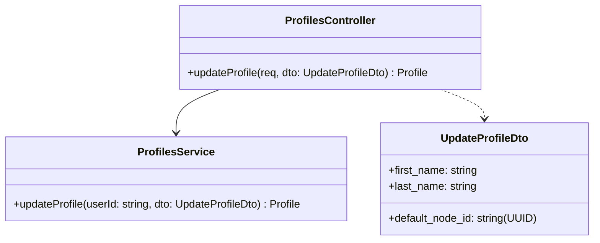
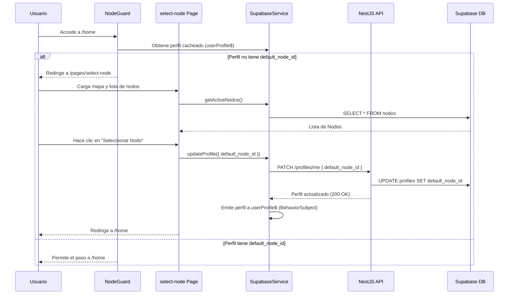

# Design: sprint-2-cliente-catalogo

## 1. Technical Approach
Implementaremos un flujo desacoplado y reactivo. El backend NestJS expondrá un módulo nuevo de perfiles (`ProfilesModule`) que encapsula la lógica de actualización parcial. El frontend utilizará Angular Standalone Guards y RxJS para persistir y recuperar de forma veloz el nodo de preferencia del cliente.

---

## 2. Backend Design (NestJS)

### Database Migrations (`supabase/migrations/`)
Crearemos un script SQL para aplicar los cambios de esquema:
```sql
-- Agregar precio minorista de referencia en productos
ALTER TABLE public.productos 
ADD COLUMN retail_price numeric NULL;

-- Agregar referencia a nodo preferido en perfiles de usuario
ALTER TABLE public.profiles 
ADD COLUMN default_node_id uuid NULL,
ADD CONSTRAINT fk_profiles_default_node 
  FOREIGN KEY (default_node_id) 
  REFERENCES public.nodos(id) 
  ON DELETE SET NULL;
```

### Module Architecture: `ProfilesModule`
Ubicación: `backend/src/profiles/`



#### Class Definitions: `UpdateProfileDto`
```typescript
import { IsOptional, IsString, IsUUID } from 'class-validator';

export class UpdateProfileDto {
  @IsOptional()
  @IsString()
  first_name?: string;

  @IsOptional()
  @IsString()
  last_name?: string;

  @IsOptional()
  @IsUUID('4', { message: 'El ID del nodo debe ser un UUID válido.' })
  default_node_id?: string;
}
```

#### Service Logic: `ProfilesService.updateProfile`
1. Extrae el `userId` (UID del JWT) del request autenticado.
2. Si `default_node_id` está provisto:
   - Consulta `public.nodos` usando `SupabaseService`.
   - Si no existe el nodo, arroja un `BadRequestException('El nodo de retiro no existe.')`.
3. Ejecuta la actualización parcial en la tabla `public.profiles` para el `userId`.
4. Retorna el registro de perfil actualizado.

---

## 3. Frontend Design (Angular 20 & Ionic 8)

### Data Flow & Cache Initialization


### Routing and Navigation
En `src/app/app.routes.ts`:
- Se agrega el `nodeGuard` a la ruta `/home`.
- Se registra la ruta `/pages/select-node` para la pantalla de selección.

### Product Catalog: Reactive Saving Calculation
En la vista del catálogo (`home.page.html`), renderizamos de forma reactiva la tarjeta de producto calculando el porcentaje de ahorro:
```html
<ion-card class="product-card">
  
  <ion-card-header>
    <ion-card-title>{{ product.name }}</ion-card-title>
    <!-- Muestra precio de compra mayorista -->
    <h2 class="price">{{ product.price | currency:'ARS':'symbol-narrow':'1.2-2' }}</h2>
  </ion-card-header>
  <ion-card-content>
    <p>Bulto de {{ product.bulk_size }} unidades</p>
    
    <!-- Incentivo de Ahorro Visual -->
    <div *ngIf="product.retail_price" class="savings-badge">
      Ahorrás un {{ calculateSavings(product.price, product.retail_price) }}%
    </div>
  </ion-card-content>
  
  <ion-button expand="block" (click)="joinGroupBuy(product.id)">
    Unirse a Compra Colectiva
  </ion-button>
</ion-card>
```

---

## 4. Testing Strategy

### Backend (Jest)
- **ProfilesController Test**: Mockear la inyección del JWT y verificar que las llamadas al DTO inválido retornan `400 Bad Request`.
- **ProfilesService Test**: Mockear las respuestas de Supabase DB. Verificar que lanzar un ID de nodo inexistente lanza la excepción correspondiente, y que un ID válido actualiza y retorna el perfil.

### Frontend (Jasmine/Karma)
- **NodeGuard Test**: Mockear el `SupabaseService` con perfiles con y sin `default_node_id`. Verificar que la redirección a `/pages/select-node` se gatilla correctamente.
- **SelectNodePage Test**: Verificar la correcta inicialización del mapa de Leaflet y que la llamada de selección de nodo emite el PATCH al backend y actualiza el BehaviorSubject.
